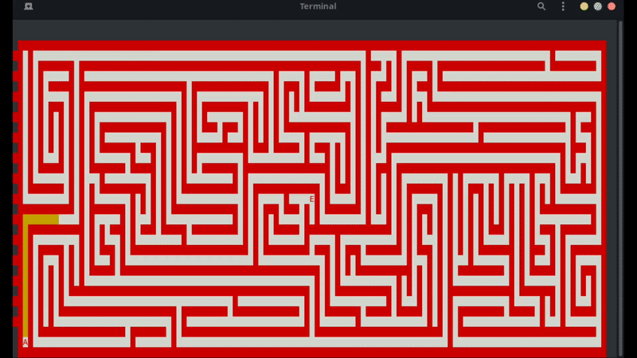
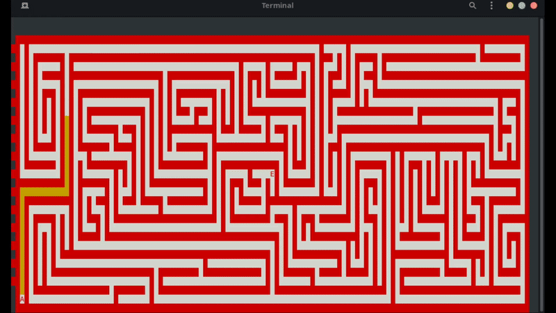
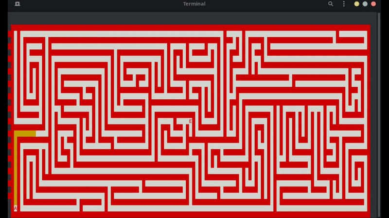

Emezama is a random generated maze taking place at the current window size created by Saford91 (https://github.com/Saford91/Emezama)

I did minor changes to the source code of Emezama,  mostly about coloring the maze and setting Start('A')/Destination('E').

Algorithms Implemented:

- DFS
- BFS
- A*
- BEST FIRST

The implementations can be found at SearchingAlgorithms.h/.cpp

# Algorithms Examples

- DFS:  702 

- BFS: 613 cells visited

- A*(Steps from start + Manhattan Distance): 560 cells visited

- Best First (Manhattan Distance) : 256 cells visited

# Emezama
A simple maze game I've been playing around with. This program utiilized the NCurses library to draw a maze on a terminal screen. The maze size is determined by the window size. The maze is automatically regenerated if the window is resized. This program consists of 6 c++ source files and 5 classes:

Cell.cpp
Maze.cpp
Player.cpp
Emezama.cpp
Window.cpp
main.cpp 

Cell:
This class represents one cell of the a maze. This class consists of five boolean values: four that represent the four walls of the cell, and one to keep track of whether or not the cell has been visited during maze generation.

Maze:
This class generates and holds the maze. The maze that is generated has dimension equal to ((W / 2) - 2),((H / 2) - 2) of the W,H of the console. Each maze cell is drawn as 3x3 console characters that overlap with the surrounding cells.

Player:
This class represents the player traversing the maze, it holds their name, the symbol representing them in the maze, and their location in the maze.

Emezama:
This class is the main class for the game, it initialized curses mode, instantiates the Maze object, and provides the main loop for the input to move the player class through the maze.

# How to Build and Run
Just 'make' it and run './Emezama'

